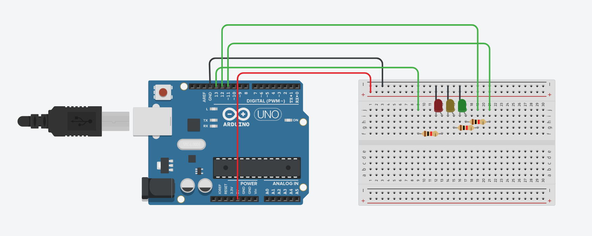
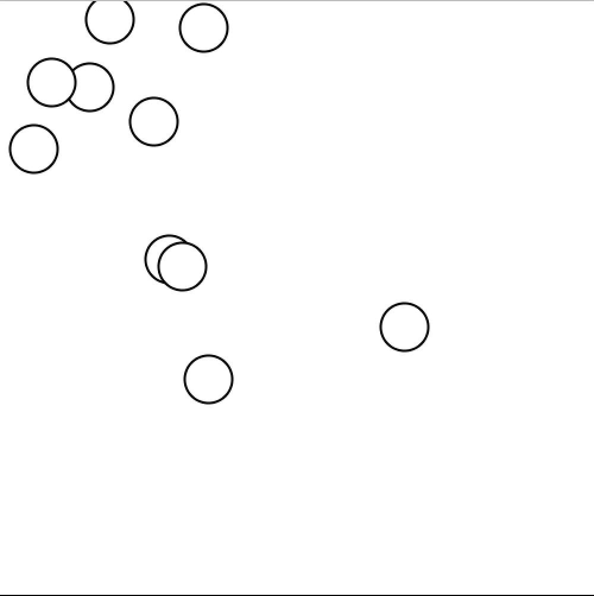

#This is my journal for Info Sci


31/01/2020
1. What did we do? We were introduced to the basics of computational thinking and info science. We simulated a computers actions through making a sandwich. 
1. What did you learn? I learnt about the basics of computational thinking, which comes in 4 steps. I also learnt about the being precise and specific when creating computer algorithms.Computers do not have the common sense that we carry. So actions that seems automatic and obvious for us has to be stated explicitly for the computer.
1. What questions do you have? I am curious about how we can input instructions to a real computer.


6/02/2020

1. What did we do? We experimented with different commands in Processing to create different shapes. We experimented with colour, size, frequency and shape.
1. What did you learn? I learnt the basics of programming in Processing. i was able to create simple shapes. I learnt about background colours, fill colours, size and shapes.
1. What questions do you have? For homework, i have to create a dice image. I am still struggling a bit but I will research into the parts that I am unsure about.


10/2/2020

1. What did we do? We made our dice image into a dice simulator that was able to give us a random number of dots between 1 and 6 whenever we "rolled" (clicked) it. We then made certain numbers more or less likely to be shown, we challenged other groups to guess which side had the bias.
1. What did you learn? I learnt how to use the random feature, as well as applying bias and increasing or decreasing the probability of a certain outcome.
1. What questions do you have? While I have a basic idea of how to apply "bias," i am still not confident this the technique


13/2/2020
1. What did we do? We made our dice simulator more complex with more features. We added a counter that showed the total number of rolls. As well as a bar graph that shows the total number of rolls of each side. We also made your dice roll automatically, meaning we no longer had to manually "click" to roll. Below is the code for the dice.
1.what did you learn? I learnt to become more confident and familiar with the program, as well as how to add the extra features.
1.Towards the end, the bar geraph grew so large that it covered the dice. I wonder if there are any solutions to this issue.
```.py
# definition of variables
one_c=0
two_c=0
three_c=0
four_c=0
five_c=0
six_c=0

def setup():
    size (600,600)
    textSize(30)
    
def draw():
    x=0
    delay(10)
    mouseClicked()
    barGraph()
    
def mouseClicked():
    global one_c, two_c, three_c, four_c, five_c, six_c
    background(255)
    stroke(0)
    fill(255)
    rect(100,100, 400, 400, 10)
    stroke(255,0,0)
    strokeWeight(10)

    
    
    n=random(0,6)
    print(n)
    if 0<=n<1:
        circle(300,300,50)
        one_c = one_c+1
        print("Number of rolls for number one",one_c)
    if 1<=n<2:
        circle(200,200,50)
        circle(400,400,50)
        two_c+=1
        print("Number of rolls for number two",two_c)
    if 2<=n<3:
        circle(200,200,50)
        circle(400,400,50)
        circle(300,300,50)
        three_c+=1
        print("Number of rolls for number three",three_c)
    if 3<=n<4:
        circle(200,200,50)
        circle(400,200,50)
        circle(200,400,50)
        circle(400,400,50)
        four_c+=1
        print("Number of rolls for number four",four_c)
    if 4<=n<5:
        circle(200,200,50)
        circle(400,200,50)
        circle(200,400,50)
        circle(400,400,50)
        circle(300,300,50)
        five_c+=1
        print("Number of rolls for number five",five_c)
    if 5<=n<6:
        circle(200,200,50)
        circle(400,200,50)
        circle(200,400,50)
        circle(400,400,50)
        circle(200,300,50)
        circle(400,300,50)
        six_c+=1
        print("Number of rolls for number six",six_c)
        
def barGraph():
    fill(0)
    text(1, 50, 590)
    text(2, 80, 590)
    text(3, 110, 590)
    text(4, 140, 590)
    text(5, 170, 590)
    text(6, 200, 590)
    
    stroke(255,0,0)
    rect(53, 560-one_c, 10, one_c)
    stroke(255,224,32)
    rect(83, 560-two_c, 10, two_c)
    stroke(0,255,0)
    rect(113, 560-three_c, 10, three_c)
    stroke(0,0,255)
    rect(143, 560-four_c, 10, four_c)
    stroke(255,96,207)
    rect(173, 560-five_c, 10, five_c)
    stroke(96,255,128)
    rect(203, 560-six_c, 10, six_c)
    
    totalRolls=one_c+two_c+three_c+four_c+five_c+six_c
    text("rolls:",400,590)
    text(totalRolls, 475, 590)
```    
20/2/2020

1. What did we do? We coded a 10 times 10 chessboard like image. We then altered the position of the black squares to create an optical illusion.
1. What did you learn? Today I was able to get more practice into programming basic shapes and adding colours. I was also able to program repeating patterns. This was able to save me a lot of time.
1. What questions do you have? This is not a direct question, but rather something i am unfamiliar with. I un still unfamiliar with the repeatuing patterns function. I think I need more practice programming basic repeating patterns.

27/2/2020

1. What did we do? I coded a simple illusion and created a brief presentation to the class.
1. What did you learn? I am now more confident with simple commands in Processing. Though the illusion only consists of simple lines, it took me a lot of trial and error to figure out.
1. What questions do you have? How do I change the colour of the all the lines?

```.py
offset=0
def setup():
    size (500, 500)
    background (255)

def mouseClicked():
    global offset
    offset-=10

    
    
def draw():
    global offset
    
    background(255)
    
    line(100, 100, 400, 100)
    line(30, 50, 100, 100)
    line(30, 150, 100, 100)
    line(470, 50, 400, 100)
    line(470, 150, 400, 100)
    
    
    line(100, 350+offset, 400, 350+offset)
    line(170, 300+offset, 100, 350+offset)
    line(170, 400+offset, 100, 350+offset)
    line(330, 300+offset, 400, 350+offset)
    line(330, 400+offset, 400, 350+offset)
```


2/3/2020

1. What did we do? We had an introduction class to Tinkercad, we created a simple circuit imitating a working traffic light.
1. What did you learn? I learnt the basics of programming and functions on Tinkercad, i was able to apply some coding skills I learnt on Processing to this new program.
1. What questions do you have? I am still unfamiliar with a lot of the functions on Tinkercad. I hope to familiarise myself more with the different virtual "parts" on the website.

```.c
void setup()
{
  pinMode(13, OUTPUT);
  pinMode(12, OUTPUT);
  pinMode(11, OUTPUT);
}

void loop()
{
  digitalWrite(13, HIGH);
  delay(2000); // Wait for 2000 millisecond(s)
  digitalWrite(13, LOW);
  delay(5); // Wait for 5 millisecond(s)
  digitalWrite(12, HIGH);
  delay(900); // Wait for 900 millisecond(s)
  digitalWrite(12, LOW);
  delay(5); // Wait for 5 millisecond(s)
  digitalWrite(11, HIGH);
  delay(2000); // Wait for 2000 millisecond(s)
  digitalWrite(11, LOW);
  delay(5); // Wait for 5 millisecond(s)
}

```

The image of the circuit is shown in Fig. 1

Fig. 1 Circuit used for the traffic light

1/4/2020

1. What was the task assigned? For our first e-assignment, we were tasked with creating a community simulation using processing. The community had 10 members. We had to create a border, circles to represent each member and random movements for each member. The members "interacted" when they came in contact with each other. This community interaction simulation is suppose to mirror the community scenario regarding the Wuhan Covid-19 Pandemic. 
1. What did you learn? Instead of manually programming each community member, I learnt to use the FOR Loop function which is much more efficient.
1. What questions did you have? What can we add to this simulation to it more realistic? Eg. clutters, colour changes (indicating healthy, infected and recovered), etc.
1. Homework Questions: What should be some behaviours (at least 3) that we will need to include in our simulation to be a realistic approximation of the current situation in the world? Explain.
Some behaviour patterns that we would need to include are groups, routines and high and low traffic areas. Groups would represent families, public transport, clubs or any other scenarios where a clear and consistent group of people would be present. Routines mirrors the routines and transportational habits that each individual has. This includes driving to work, walking home from school, etc. Finally, the simulation should not have the same population density throughout. We need to include high traffic areas (malls, office blocks, etc) and low traffic areas (forests, mountains, residential suburbs, etc) to make the simulation more realistic.

```.py
# definition of variables
x = []
y = []


def setup():
    size(500, 500) 
    
    #create random individual 
    for i in range(20):
        x. append(random(0,500))
        y. append(random(0,500))
    
def draw():
   
    background(255)
    strokeWeight(2)
    global x, y
    
    #First Individual
    for i in range(20):
          circle(x[i], y[i], 40)
          x[i] = x[i] + random(-10,10)
          y[i] = y[i] + random(-10,10)
          
          if x[i] > 500:
            x[i] = 500
          if x[i] < 1:
            x[i] = 1
          if y[i] > 500:
            y[i] = 500
          if y[i] < 1:
            y[i] = 1
        

   delay(100)
    
```
    
A screenshot of the simulation is shown in Fig. 1

Fig. 1 Screenshot of the community simulation


8/4/2020

1. What was the task assigned? Along with a few minor tasks, our main task this week was to further our community simulation. I increased the population form 10 members to 20. I also added an infection indicator. I coloured all infected members red, while leaving all healthy members white. When an infected member came within a certain distance of a healthy member, the healthy member turned red, thereby being "infected."
1. What did you learn? Along with the minor tasks, I am now confident with using the For Loop function in Python.
1. What questions did you have? I struggled to add a real-time bar graph counter and iteration counter.

```.py
# definition of variables
x = [100,200]
y = [100,200]
h = [False, True] #False=>Infected


def setup():
    size(500, 500) 
    
    #create random individual 
    for i in range(20):
        x. append(random(0,500))
        y. append(random(0,500))
        h. append(True) #All healthy
        
def distance(x1, x2, y1, y2):
    a = (x1 - x2)
    b = (y1 - y2)
    c = sqrt(a**2 + b**2 ) 
    return c
    
    
def draw():
   
    background(255)
    strokeWeight(2)
    global x, y
    
    
    
    #First Individual
    for i in range(20):
          if h[i] == True:
              fill(255) #healthy
          else:
              fill(255, 0, 0) #infected
              
          circle(x[i], y[i], 40)
          #calculate the distance to each neighbour
          for nei in range(len(x)):
              if nei == i:
                  continue
              d = distance(x[i], x[nei], y[i], y[nei])
              if d < 40 and (h[nei] == False or h[i] == False):
                  #infection happens
                  h[i] = False
                  h[nei] = False
          x[i] = x[i] + random(-10,10)
          y[i] = y[i] + random(-10,10)
          
          if x[i] > 500:
            x[i] = 500
          if x[i] < 1:
            x[i] = 1
          if y[i] > 500:
            y[i] = 500
          if y[i] < 1:
            y[i] = 1
        

    delay(100)
```
A screenshot of the simulation is shown in Fig. 1
(Screen Shot 2020-04-09 at 11.34.51 AM.png)
Fig. 1 Screenshot of the community simulation

```.py
#Homework Task 1 - Bear Counter Code
for i in range(1,101):
    print str(i)+"bear"
```

```.py
#Homework Task 2 - The year is xxxx
for i in range(1900,2001):
    print "The year is " + str(i)
```

```py.
#Homework Task 3 - Celcius to Farenheit Converter Table
for celcius in range(0,101):
    farenheit = 9 / 5 * celcius + 32
    print str(celcius) + " C are " + str(farenheit) + " F"
```

